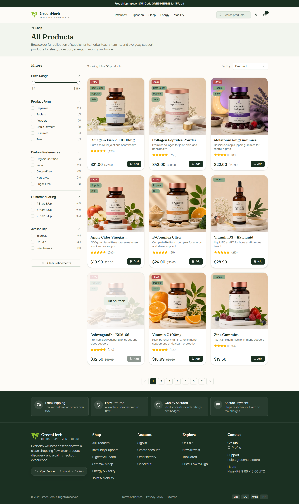

# GreenHerb Storefront

Frontend ecommerce storefront built with Next.js App Router.

The project was built around a constraint that usually creates trade-offs: catalog pages should feel fast, auth should survive refreshes without leaking into unrelated UI, carts should survive the jump from guest to signed-in state, and checkout totals should come from the backend instead of client-side guesses. The frontend leans on static product routes where that helps browsing speed, but keeps auth, cart sync, and checkout state coordinated through shared hooks and services so the app behaves closer to a production storefront than a static shop demo.

This repository contains the frontend application. The backend lives here:
- [GreenHerb backend](https://github.com/webdm0/greenherb-backend)

## Demo

### Storefront Catalog


<details>
<summary>See the product details page</summary>


</details>

<details>
<summary>See the checkout flow</summary>


</details>

### Live Demo

The production build is hosted and open for evaluation. You can test the full e-commerce flow.

- Live app: [View live demo]()

> The backend runs on free-tier hosting and may take up to about a minute to wake up after inactivity.

## What's In The App

- storefront browsing with search, sorting, category pages, and faceted filters
- statically rendered storefront and category routes with server-fetched product data
- product detail pages generated from backend slugs
- register, login, logout, refresh-session recovery, and Google sign-in
- guest cart stored locally
- authenticated cart sync with the backend
- guest cart merge after sign-in or registration
- protected checkout with Stripe Elements
- backend-validated pricing, shipping, and promo codes
- checkout success flow and order history at `/orders`
- metadata, sitemap, robots, manifest, and product cache revalidation

## Why It Was Built This Way

- `Fast browsing without frozen product data`: storefront and category routes lean on server fetching and static generation, while product content can still be refreshed through revalidation.
- `Access + refresh auth model`: protected requests use an in-memory access token, while session recovery is validated through shared request logic and server-side session checks.
- `Cart continuity across auth states`: guest cart state lives locally first, then merges into the authenticated backend cart after sign-in or registration.
- `Checkout totals stay server-owned`: pricing, shipping, promo codes, and final payment amounts are treated as backend data instead of frontend calculations.
- `Route protection before page load`: [`proxy.ts`](./proxy.ts) guards `/checkout` and `/orders`, and keeps auth pages guest-only when there is already a valid session.
- `Structure under app complexity`: the project follows `Component -> Hook -> Service`, so auth orchestration, cart syncing, pricing state, and network logic stay out of presentational components.

## Stack

- Next.js 16 App Router
- React 19 and TypeScript
- Tailwind CSS 4
- TanStack React Query
- Axios request layer centralized in [`services/api/request.ts`](./services/api/request.ts)
- Stripe Elements for checkout
- Radix UI primitives
- Next.js metadata, sitemap, robots, and cache revalidation support
- Vercel Analytics
- Vitest and Testing Library

## Where To Look In Code

- [`proxy.ts`](./proxy.ts): route protection, refresh-cookie checks, and session hint validation
- [`services/api/request.ts`](./services/api/request.ts): request pipeline, token injection, refresh retry, and normalized errors
- [`components/auth/auth-provider.tsx`](./components/auth/auth-provider.tsx): auth provider wiring and session lifecycle
- [`hooks/useCart.tsx`](./hooks/useCart.tsx): guest cart persistence, signed-in cart sync, and cart handoff after auth
- [`services/api/server/products.ts`](./services/api/server/products.ts): server-side product fetching, slug generation, and cache tags
- [`components/products/shop-page-content.tsx`](./components/products/shop-page-content.tsx): storefront browsing flow, filters, and sorting UI
- [`components/checkout/checkout-page-client.tsx`](./components/checkout/checkout-page-client.tsx): checkout page orchestration
- [`hooks/checkout/useCheckoutPricing.ts`](./hooks/checkout/useCheckoutPricing.ts): pricing refresh, shipping selection, and promo-code state
- [`app/api/revalidate/route.ts`](./app/api/revalidate/route.ts): protected revalidation endpoint
- [`middleware.test.ts`](./middleware.test.ts): route-protection test coverage

## Running It Locally

This frontend is meant to run together with the backend repository.

1. Start the backend by following the setup in the [backend repository](https://github.com/webdm0/greenherb-backend).
2. Create `.env.local` from [`.env.example`](./.env.example).
3. Install dependencies and start the frontend:

```bash
npm install
npm run dev
```

Default local URL:
- `http://localhost:3000`

Example environment variables:

```env
BACKEND_ORIGIN=http://localhost:5187
SITE_URL=http://localhost:3000
NEXT_PUBLIC_GOOGLE_CLIENT_ID=your-google-client-id.apps.googleusercontent.com
NEXT_PUBLIC_STRIPE_PUBLISHABLE_KEY=pk_test_your_stripe_publishable_key
SESSION_HINT_KEY=change-me-session-hint-key-please-0987654321
SESSION_HINT_ISS=GreenHerb.Api
SESSION_HINT_AUD=GreenHerb.Frontend
SSG_REVALIDATE_SECRET=YOUR_GUID
```

Environment notes:
- `BACKEND_ORIGIN`: server-side requests, session validation, and `/backend/:path*` rewrites
- `SITE_URL`: metadata, sitemap, robots, and canonical URL generation
- `NEXT_PUBLIC_GOOGLE_CLIENT_ID`: Google sign-in
- `NEXT_PUBLIC_STRIPE_PUBLISHABLE_KEY`: Stripe payment form
- `SSG_REVALIDATE_SECRET`: protects [`app/api/revalidate/route.ts`](./app/api/revalidate/route.ts)
- `SESSION_HINT_KEY`, `SESSION_HINT_ISS`, and `SESSION_HINT_AUD`: server-only values used by [`proxy.ts`](./proxy.ts) to validate the backend-issued `__session_hint` cookie

For Stripe test mode, use card `4242 4242 4242 4242` with any future expiry date and any CVC.

## Notes

- GreenHerb is a fictional storefront brand used to give the catalog, product pages, and checkout flow a consistent product context.
- The repository focuses on the frontend application; payment confirmation, pricing rules, cart persistence, and order handling depend on the paired backend.